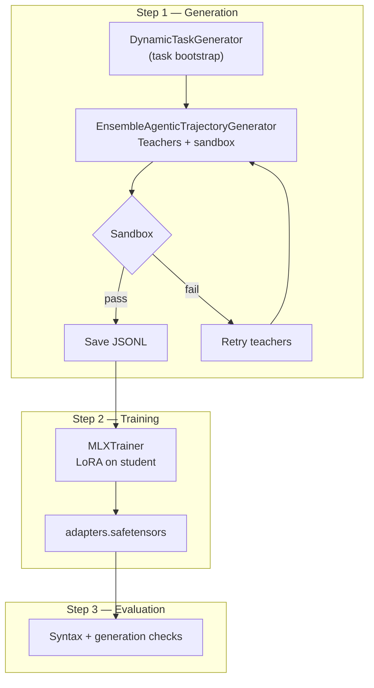

# DingoAI

**Local MLX self-training for Claude Code–style agentic tool use** — on Apple Silicon, with no cloud APIs.

DingoAI wraps a full **Generation → Training → Evaluation** loop: teacher models produce verified `write_file` / `python` / `list_dir` trajectories in a sandbox; a student model (Gemma 4 26B MoE) is fine-tuned with LoRA via [MLX](https://github.com/ml-explore/mlx).

Repository: [github.com/True2456/DingoAI](https://github.com/True2456/DingoAI)

---

## Web console

The fastest way to run the pipeline is the **DingoAI console** — model paths, prompt presets, generation, train-only jobs, and live logs in one local UI.

```bash
git clone https://github.com/True2456/DingoAI.git
cd DingoAI
./run_web_gui.sh
```

Opens **http://127.0.0.1:8765** (local machine only).

### Screenshots


Features in the UI:

- **Presets** — save/load model settings and generation prompts (`config/dingo_presets.json`), including Antigravity, red team, and network-optimization curricula
- **Path browser** — pick folders via Browse; edit **file names** only for JSONL outputs
- **Train ratio hint** — warns when iterations ÷ samples exceeds safe limits
- **Job logs** — download or clear logs; scroll pinning so logs do not jump while you read

---

## Quick start

| Goal | Command |
|------|---------|
| **Web console** | `./run_web_gui.sh` |
| **Smoke test** | `./run_smoke.sh` |
| **Full loop** | `./run_resume.sh` |
| **Generate only** | `./run_generate.sh 100` |
| **Train on curated data** | `./run_train_only.sh data/curated/all_tool_training.jsonl 120` |

`run_web_gui.sh` creates `mlx_foundation/venv` on first launch and installs dependencies.

### Curated training data

After generation, curate trajectories locally (not committed — `data/` is gitignored):

```bash
python3 tools/curate_all.py
```

Primary tool-use pack: **`data/curated/all_tool_training.jsonl`** (merged, deduped `write_file` + `python` workflows).

---

## Flow



---

## Architecture

| Component | Role |
|-----------|------|
| `mlx_foundation/src/generator/generator.py` | Task bootstrap + multi-teacher trajectories with sandbox verification |
| `mlx_foundation/src/sandbox/sandbox.py` | `write_file`, `read_file`, `list_dir`, `python` (unittest-aware pass/fail) |
| `mlx_foundation/src/trainer/trainer.py` | LoRA fine-tuning with observation loss masking |
| `mlx_foundation/src/evaluator/evaluator.py` | Agentic format checks + collapse gate |
| `mlx_foundation/src/main.py` | Orchestrator: smoke / full / generate-only / train-only |
| `web/` | DingoAI local console (`web/server.py`) |
| `tools/curate_*.py` | Tier and merge JSONL into `data/curated/` |

### Prompt presets

Built-in generation presets live in [`config/dingo_presets.json`](config/dingo_presets.json):

| Preset | Focus |
|--------|--------|
| `antigravity-prompt` | Security, CSV patch, refactor, validation (Tests 1–5 style) |
| `red-team-prompt` | Path traversal, zip slip, injection, secrets, TOCTOU |
| `network-optimize-prompt` | Payload size, batching, compression (local mock transport) |

Load in the console under **Generation prompt → Preset → Load**.

Run notes and Antigravity benchmarks: [`docs/generation_findings.md`](docs/generation_findings.md).

---

## Models (local)

| Role | Example | Notes |
|------|---------|--------|
| Student | `gemma-4-26b-a4b-it-bf16` | MLX MoE student |
| Teachers | Qwen Coder Next, Gemma 31B | From `~/.lmstudio/models/` |

Configure paths in the console or [`config/default_config.json`](config/default_config.json). Weights are **not** included in this repo.

---

## Training safety

Keep **training iterations ÷ samples ≤ ~3×** on MoE students to avoid memorization. The console shows a live ratio when you pick a JSONL file.

```
OK:     120 iters / 85 samples ≈ 1.4×
Risky:  500 iters / 20 samples = 25×
```

LoRA targets **self-attention only** (rank 16, LR 1.5e-6) so MoE routing stays stable. See README sections in git history for full LoRA and token-format detail.

---

## CLI reference

```bash
./run_generate.sh 100 data/generated/my_batch.jsonl
./run_train_only.sh data/curated/all_tool_training.jsonl 120 models/mlx_self_training/dingo_v1
./mlx_foundation/venv/bin/python mlx_foundation/src/main.py --mode generate-only --samples 20 --output data/generated/run.jsonl
python3 tools/promote_false_rejects.py   # recover stderr false rejects from *_failed_attempts.jsonl
python3 tools/curate_all.py              # refresh data/curated/
```

### Regenerating UI screenshots

```bash
pip install playwright && playwright install chromium
python3 tools/capture_gui_screenshots.py
```

Writes `docs/images/dingoai-console-overview.png`.

---

## Two-machine workflow

Use a second Mac for generation only; train on the primary machine:

```
Second Mac:  ./run_generate.sh 100  →  batch.jsonl
Primary Mac: ./run_train_only.sh batch.jsonl
```

---

## License

MIT
