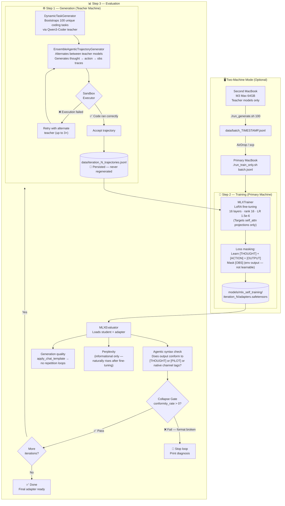

# LLM Self-Training Foundation

An automated **knowledge distillation loop** for Apple Silicon, using teacher models to generate agentic coding trajectories and fine-tuning a student model via LoRA — all running locally with [MLX](https://github.com/ml-explore/mlx).

## Flow Diagram



## Overview

This project implements a full **Generation → Training → Evaluation** orchestration loop. Large "teacher" models synthesize agentic coding trajectories (thought → action → observation → output) that are used to fine-tune a smaller, more efficient "student" model. No cloud APIs required — everything runs on-device.

## Architecture

| Component | Description |
|---|---|
| `src/generator/generator.py` | `DynamicTaskGenerator` bootstraps unique coding tasks. `EnsembleAgenticTrajectoryGenerator` generates verified thought/action/obs traces using alternating teacher models and a real sandbox executor |
| `src/trainer/trainer.py` | `MLXTrainer` — LoRA fine-tuning via `mlx_lm`. Loss-masks the prompt and `[OBS]` blocks so the model only learns to generate `[THOUGHT]`, `[ACTION]`, and `[OUTPUT]` |
| `src/evaluator/evaluator.py` | `MLXEvaluator` — checks agentic syntax conformity, generation quality (via chat template), and perplexity (informational). Collapse gate uses conformity rate, not perplexity |
| `src/main.py` | `MLXSelfTrainingOrchestrator` — wires everything together, caches generated data, enforces the iter/sample safety ratio |

## Key Design Decisions

### Iteration/Sample Ratio
The number of training iterations must scale with the number of samples. For MoE models, we use a slightly higher step count to update routing behaviors stably, keeping the ratio around 3-6×.

```
✅ Safe (MoE): 600 iters / 100 samples = 6.0x (3 epochs for routing parameters)
❌ Memorization: 500 iters / 20 samples = 25.0x  ← causes catastrophic memorization
```

### Agentic Token Format
Custom control tokens use plain square-bracket markers — **not** `<|...|>` style.

```
✅  [THOUGHT]...[END]  [ACTION]...[END]  [OUTPUT]...[END]
❌  <|thought|>        ← Gemma-4 tokenizer treats <|...| > as its own
                          special token prefix, corrupting the learned format
```

### LoRA Configuration
| Parameter | Value | Rationale |
|---|---|---|
| `num_layers` | 16 | 16 layers targeted to self-attention provides enough gradient signal to steer the model. |
| `keys` | `["self_attn.q_proj", "self_attn.v_proj", "self_attn.k_proj", "self_attn.o_proj"]` | Explicitly targets self-attention projections, leaving MoE routing gates and expert weights pristine to completely avoid routing collapse. |
| `rank` | 16 | Higher rank gives each layer more expressive bandwidth |
| `alpha` | 32 | Standard 2× convention (`alpha = 2 × rank`) |
| `learning_rate` | 1.5e-6 | MoE routing gates and experts are highly sensitive; 1.5e-6 provides stable updates. |

### Collapse Gate (Conformity-Based)
After each iteration, if `token_conformity_rate == 0.0` the loop halts. The conformity checker is aligned to support custom tags (`[THOUGHT]`/`[ACTION]`), model-converged pilot tags (`[PILOT-MODE-ON]`/`[PILOT-OUTPUT-1]`), and native chat templates. Perplexity is **not** used as a collapse signal.

### Trajectory Caching
Generated trajectories are saved to `data/iteration_N_trajectories.jsonl` immediately after generation. On the next run, if the file exists it's loaded instead of regenerating (~1hr of teacher compute saved per iteration). Delete the file to force fresh generation.

## Two-Machine Workflow

If you have a second Apple Silicon machine (64GB RAM), use it purely for generation — it only needs the teacher models, not the 26B student.

```
Second MacBook (M3 Max 64GB)        Primary MacBook
─────────────────────────           ─────────────────────
./run_generate.sh 100               (training on prev batch)
  → data/batch_TIMESTAMP.jsonl
            │
            │  AirDrop / scp
            ▼
                                    ./run_train_only.sh data/batch.jsonl
```

Generation and training overlap — while your primary machine trains on one batch, the second machine builds the next.

## Models

| Role | Model | Notes |
|---|---|---|
| Student | `gemma-4-26b-a4b-it-bf16` | Gemma 4 26B MoE, 4-bit quantized |
| Teacher 1 | `Qwen3-Coder-Next-MLX-8bit` | Primary code trajectory generator |
| Teacher 2 | `gemma-4-31b-it-oQ8` | Fallback / ensemble teacher |

Models are loaded from `~/.lmstudio/models/` and are **not** included in this repository.

## Installation

```bash
git clone https://github.com/True2456/LLM-Self-Training-Foundation
cd LLM-Self-Training-Foundation

python -m venv mlx_foundation/venv
source mlx_foundation/venv/bin/activate
pip install -r requirements.txt
```

## Usage

### Smoke test (1 iteration, 1 sample, 15 training steps)
```bash
./run_smoke.sh
```

### Full distillation run (3 iterations, 100 samples, 200 steps each)
```bash
./run_resume.sh          # auto-detects latest checkpoint and resumes, or starts fresh
```

### Generate trajectories only (second machine)
```bash
./run_generate.sh 100                        # generate 100 trajectories
./run_generate.sh 200 data/my_batch.jsonl    # custom count and path
```

### Train on a pre-generated batch (primary machine)
```bash
./run_train_only.sh data/batch.jsonl         # 200 iters (default)
./run_train_only.sh data/batch.jsonl 150     # custom iter count
```

### Manual modes
```bash
python mlx_foundation/src/main.py --mode smoke
python mlx_foundation/src/main.py --mode full
python mlx_foundation/src/main.py --mode generate-only --samples 100 --output data/batch.jsonl
python mlx_foundation/src/main.py --mode train-only --data data/batch.jsonl
```

## Commercial Dataset Exporter (High-Fidelity Packaging)

The framework includes a zero-touch **Commercial Dataset Exporter** that packages raw agent trajectories into a premium, commercial-grade dataset format (fully compliant with **ShareGPT** and **HuggingFace** conversational formats). 

This dataset format is highly valuable for model developers, licensing, or commercial monetization as it captures complex multi-turn debugging, compiler outputs, and self-correction traces.

### Features
* **Zero-Touch Automation:** Automatically runs at the end of both `full` self-training runs and `generate-only` standalone phases.
* **ShareGPT/Axolotl Compliance:** Instantly formatting conversational turns using strict system, human, gpt, and tool roles.
* **Dual-Fidelity Parsing:** Reconstructs full turns gracefully even from older low-fidelity logs, and records high-fidelity trace structures natively for all future runs.
* **Trace Verification Tagging:** Injects specific teacher model origin tags and sandbox certification metadata into every entry.

### Usage

To manually compile or update your commercial dataset file at any time, run:
```bash
./mlx_foundation/venv/bin/python mlx_foundation/src/utils/export_dataset.py
```

### Premium JSON Structure
The exporter writes to `data/mlx_commercial_agent_trajectories_v1.json` with the following clean, highly marketable schema:
```json
[
  {
    "id": "mlx_agent_traj_1_0001",
    "metadata": {
      "task_description": "Write a Python script that calculates...",
      "verified_sandbox_success": true,
      "teacher_model_origin": "/Users/true/.../Qwen3-Coder-Next-MLX-8bit",
      "format_version": "1.1-HighFidelity"
    },
    "conversations": [
      { "from": "system", "value": "You are a local sandboxed Python..." },
      { "from": "human", "value": "Write a Python script that calculates..." },
      { "from": "gpt", "value": "[THOUGHT]I need to...\n[ACTION]Action (python): ..." },
      { "from": "tool", "value": "[OBS]120[END]" },
      { "from": "gpt", "value": "[OUTPUT]Execution completed successfully.[END]" }
    ],
    "turns_trace": [
      {
        "turn": 1,
        "thought": "I need to implement a recursive factorial...",
        "action": { "type": "python", "input": "print(120)" },
        "observation": { "stdout": "120\n", "stderr": "", "success": true }
      }
    ]
  }
]
```

## Output Structure

```
models/mlx_self_training/
├── iteration_1/
│   ├── adapters.safetensors          ← final adapter weights
│   ├── adapter_config.json
│   ├── 0000100_adapters.safetensors  ← mid-run checkpoints
│   └── 0000200_adapters.safetensors
├── iteration_2/
└── iteration_3/

data/
├── iteration_1_trajectories.jsonl    ← cached — never regenerated
├── iteration_2_trajectories.jsonl
└── iteration_3_trajectories.jsonl
```

Each adapter is a **LoRA diff** on top of the base student model — the base weights are never modified.

## Agentic Format

The student is trained to produce structured agentic traces using plain-text control markers:

```
Task: Write a script that counts files in a directory.

[THOUGHT]I need to use os.listdir() to count files in the current directory.[END]
[ACTION]python: import os; print(len([f for f in os.listdir('.') if os.path.isfile(f)]))[END]
[OBS]7[END]
[OUTPUT]There are 7 files in the current directory.[END]
```

Loss is masked on the `[OBS]` block — the model learns to reason and act, not to predict environment outputs.

## License

MIT

### Memory Management & 26B Support
This codebase has been specifically engineered to support 26B+ Mixture-of-Expert (MoE) models directly on Apple Silicon in `bf16` precision (e.g. `gemma-4-26b-a4b-it-bf16`). By strictly controlling garbage collection, enforcing `mlx.core.clear_cache()` boundaries between generation, training, and evaluation steps, and properly freezing MoE routing layers prior to LoRA injection, this pipeline maintains a perfectly stable peak VRAM footprint of ~55GB—completely preventing the 110GB+ memory spike overlap bugs common in native MLX-LM setups.
