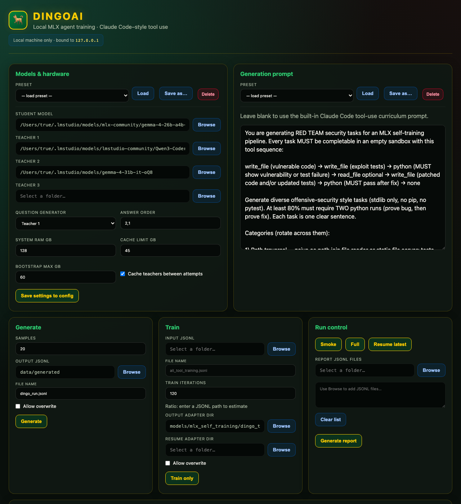

# DingoAI

Train a local Gemma model to use tools the way Claude Code does — `write_file`, `read_file`, `list_dir`, and `python` in a sandbox — without sending data to a cloud API.

You point teacher models at tasks, they produce multi-step trajectories, the sandbox checks that tests actually pass, and MLX LoRA fine-tunes your student on the ones that work. Everything runs on your Mac.

Repo: [github.com/True2456/DingoAI](https://github.com/True2456/DingoAI)

---

## What you get

1. **Generate** — teachers write code and run `unittest` in an empty sandbox until a trajectory passes.
2. **Curate** — merge runs, drop weak rows, build `data/curated/all_tool_training.jsonl`.
3. **Train** — LoRA on the student (default: Gemma 4 26B MoE).

There is a second **oMLX / Claude Code** wire format (`call:Read{…}` style) for serving through [oMLX](https://github.com/ml-explore/mlx). See [docs/TRACK2_OMLX.md](docs/TRACK2_OMLX.md).

---

## Quick start

```bash
git clone https://github.com/True2456/DingoAI.git
cd DingoAI
./run_web_gui.sh
```

Opens **http://127.0.0.1:8765** on this machine only.

| What | Command |
|------|---------|
| Web UI | `./run_web_gui.sh` |
| Smoke test | `./run_smoke.sh` |
| Generate 100 samples | `./run_generate.sh 100` |
| Train on curated data | `./run_train_only.sh data/curated/all_tool_training.jsonl 120` |
| Rebuild curated pack | `python3 tools/curate_all.py` |

Weights live under `~/.lmstudio/models/` (or paths you set in the console). They are not in this repo.

---

## Web console



The UI handles model paths, prompt presets, generate/train jobs, and live logs. Useful bits:

- Presets in `config/dingo_presets.json` (Antigravity-style security, red team, networking, JSON-patch focus, oMLX track).
- **Training track** — Dingo tools vs oMLX Claude markup.
- **Build oMLX pack** — writes `data/curated/all_omlx_tool_training.jsonl` from the Dingo curated file.
- Train ratio warning when iterations ÷ samples gets too high.

Regenerate the screenshot:

```bash
pip install playwright && playwright install chromium
python3 tools/capture_gui_screenshots.py
```

---

## Numbers from local runs

`data/` is gitignored; these come from JSONL on disk as of May 2026.

| What | Count | Notes |
|------|------:|-------|
| Merged curated pack | **349** | `data/curated/all_tool_training.jsonl` after `curate_all.py` |
| Saved trajectories (all runs) | **454** | Lines across `data/generated/*.jsonl` (not counting `*_failed_attempts.jsonl`) |
| `qwencoder7` batch | **5** saved, **23** failed attempts | Hard Antigravity-style tasks; most failures were bad JSON from teachers, not sandbox rejects — [details](docs/generation_findings.md) |
| Read-before-patch runs | **30/30** saved → **28** kept | `NewModelRun7-ReadFocus` JSONL; curation dropped 2 |
| `V3_Jsonpatch2` | **36** saved → **32** kept | After sort/curation |

Early batches (generic tooling prompts, Qwen-first teacher order) often saved well under half of requested samples. After read_file-focused prompts and putting Gemma first in the teacher order, 30-sample runs commonly save **all** lines to JSONL; curation may still trim a few.

Do not read `*_failed_attempts.jsonl` line counts as “samples requested” — each line is usually one teacher attempt that did not produce a kept trajectory.

---

## How generation fails (and what we changed)

Typical failure modes, in order of how often they showed up in logs:

1. Teacher returns malformed JSON → turn discarded.
2. Patch task finishes without a second `python` after the fix → workflow reject.
3. Task wording ambiguous (e.g. “reverse words” interpreted differently by different models).

Five reference tasks were run in Antigravity (Gemini) and compared to MLX teachers on the same instructions. MLX saved **0/5** on that set in `qwencoder7`; Antigravity completed all five. Write-ups: [docs/generation_findings.md](docs/generation_findings.md).

Prompt rules learned from that work are baked into `mlx_foundation/src/generator/generator.py` (fail-then-patch flow, `unittest` only, `read_file` before patch when required).

---

## Layout

| Path | Purpose |
|------|---------|
| `mlx_foundation/src/generator/` | Task bootstrap + multi-teacher trajectories |
| `mlx_foundation/src/sandbox/` | Tool execution and test verification |
| `mlx_foundation/src/trainer/` | LoRA training |
| `web/` | Local console |
| `tools/curate_*.py` | Tier, merge, promote false rejects |
| `config/dingo_presets.json` | Named prompt + model presets |

---

## Training notes

On MoE students, keep **training iterations ÷ curated samples ≤ ~3×** to limit memorization. The console shows the ratio when you pick a JSONL file.

LoRA is self-attention only (rank 16, LR 1.5e-6) so routing stays stable.

---

## Two Macs

Generate on a second machine, copy the JSONL, train on the main one:

```
Second Mac:  ./run_generate.sh 100  →  batch.jsonl
Primary Mac: ./run_train_only.sh batch.jsonl
```

---

## License

MIT
